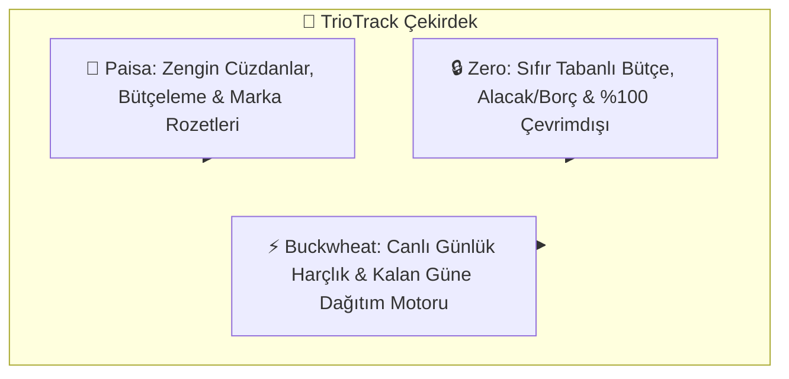
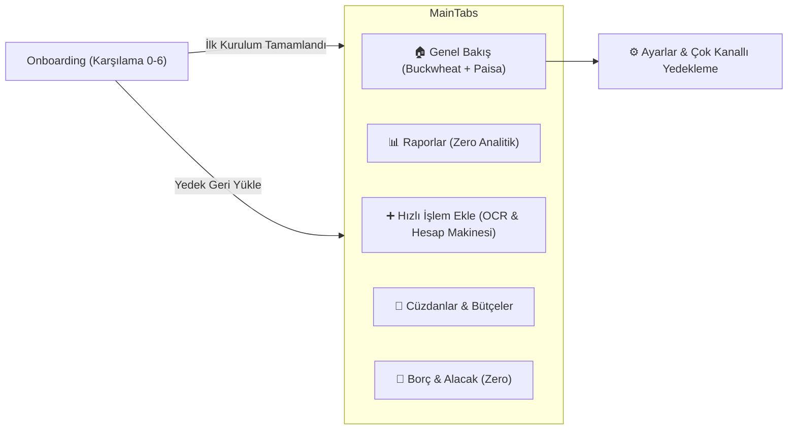
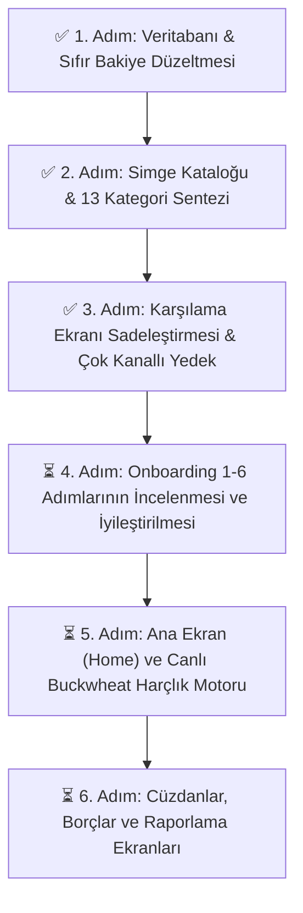

# 📘 TrioTrack — Kapsamlı Proje ve Mimari Dokümantasyonu

> **Sürüm:** 1.6.0  
> **Son Güncelleme:** 10 Eylül 2026  
> **Durum:** Aktif Geliştirme (Adım Adım İlerleme)

---

## 📑 İçindekiler
1. [Proje Vizyonu ve Hibrit Felsefe](#1-proje-vizyonu-ve-hibrit-felsefe)
2. [Ekran Akışı & Adım Adım Mimari](#2-ekran-akisi--adim-adim-mimari)
3. [Karşılama Ekranı & Çok Kanallı Yedekleme Sistemi](#3-karsilama-ekrani--cok-kanalli-yedekleme-sistemi)
4. [Veri Modeli ve Depolama Mimarisi](#4-veri-modeli-ve-depolama-mimarisi)
5. [OCR, CDN Marka Logoları ve Simge Kataloğu](#5-ocr-cdn-marka-logolari-ve-simge-katalogu)
6. [Animasyon ve Arayüz Altyapısı](#6-animasyon-ve-arayuz-altyapisi)
7. [Adım Adım Yol Haritası ve Değişiklik Günlüğü](#7-adim-adim-yol-haritasi-ve-degisiklik-gunlugu)

---

## 1. Proje Vizyonu ve Hibrit Felsefe

TrioTrack, modern açık kaynak kişisel finans dünyasının en güçlü ve sevilen üç uygulamasının en iyi taraflarını tek bir yerel, gizlilik odaklı mimaride harmanlar:

### 3 Temel Direk (The 3 Pillars)
* **Paisa:**
  * Modern Material You tasarım estetiği ve dinamik renk temaları.
  * Çoklu cüzdanlar (Nakit, Banka, Kredi Kartı, Birikim).
  * Kategori bazlı harcama limitleri ve bütçe ilerleme çubukları.
  * Dijital abonelik ve platform marka rozetleri (Netflix, Spotify, YouTube vb.).
* **Zero:**
  * Sıfır tabanlı bütçeleme (Zero-based budgeting) felsefesi.
  * %100 yerel ve çevrimdışı gizlilik (Veriler yalnızca cihazda saklanır, dışa sızmaz).
  * Gelişmiş vadeli borç/alacak ve kısmi ödeme takip sistemi.
  * Akıllı çift dilli (Türkçe & İngilizce) arama normalizasyonu.
* **Buckwheat:**
  * Dinamik günlük harçlık motoru.
  * Maaş veya bütçe döngü gününe kadar her gün ne kadar harcama yapılabileceğini anlık hesaplama.
  * Harcama yapılmadığında artan bütçeyi kalan günlere akıllıca paylaştırma modu (`split_to_rest_days`).

---

## 2. Ekran Akışı & Adım Adım Mimari

Uygulamanın ekran geçiş mimarisi React Navigation Native Stack ve Bottom Tabs ile yönetilir:

---

## 3. Karşılama Ekranı, Bottom Sheet Mimarisi & Çok Kanallı Yedekleme

### 3.1. Karşılama Ekranı (Slide 0) Tasarımı
* **Resmi TrioTrack Logosu:**
  * Paisa (Viyolet/İndigo), Zero (Zümrüt Yeşili) ve Buckwheat (Kehribar Altın) kimliklerini temsil eden 3 boyutlu sonsuzluk (mobius) app ikonu üretildi ve `assets/triotrack_logo.png` olarak başlığın üstüne eklendi.
* **Hibrit Sentez Manifestosu:**
  * *"Paisa'nın zengin cüzdan estetiği, Zero'nun sıfır tabanlı gizlilik disiplini ve Buckwheat'in akıllı günlük harçlık zekası tek bir kusursuz deneyimde buluştu."*
* **3 Temel Direk Kartları:** Paisa, Zero ve Buckwheat kartları yumuşak renk tonları ve net açıklamalarla konumlandırıldı.
* **"Zaten bir yedeğim var (Geri Yükle)" Butonu:** Ekranın alt kısmında kullanıcıyı karşılar ve tek dokunuşla Bottom Sheet açar.

### 3.2. Ekranla Bütünleşik Modern Bottom Sheet (Alt Çekmece) Mimarisi
Eski masaüstü tarzı, ekranın tam ortasında beliren ve mobil hissi vermeyen kutu şeklindeki pencereler yerine **Modern Mobil Bottom Sheet Standartları** getirildi:
* **Ekran Bütünlüğü:** Ekranın tabanına oturan (`justifyContent: 'flex-end'`), üst köşeleri yumuşakça yuvarlatılmış (`borderTopLeftRadius: 28, borderTopRightRadius: 28`) tasarım.
* **Çekme Tutamacı (Sheet Handle):** Pencerenin tepesinde minimalist tutamaç çubuğu (pill bar).
* **Güvenli Alan (Safe Area):** Cihazın alt bar/çentik yüksekliğine (`insets.bottom`) dinamik uyum.
* **Doğal Kapanış:** Boş alana dokunulduğunda (`TouchableWithoutFeedback`) veya kapat butonuna basıldığında ekranın altına kayarak kapanma.
* **Uygulanan Ekranlar:** Hem `OnboardingScreen` (Yedek Geri Yükleme) hem de `SettingsScreen` (Hedef Belirleme, Yedek Alma, Yedek Yükleme).

### 3.3. Çok Kanallı Yedekleme & Geri Yükleme Motoru (`backupService.ts`)
Yedekleme sistemi tek bir metin kutusundan çıkarılmış, hem karşılama ekranında hem de ayarlar ekranında **4 farklı kanala** kavuşturulmuştur:

| Kanal | Teknoloji | Açıklama |
|---|---|---|
| 📁 **Cihazdan .json Dosyası Seç** | `expo-document-picker` + `expo-file-system` | Telefonun dosya yöneticisinden `.json` yedeğini tek dokunuşla seçip okuma. Google Drive, iCloud, İndirilenler doğrudan seçilebilir. |
| 📋 **Panodan Yapıştır (Tek Dokunuş)** | `expo-clipboard` | Kopyalanan JSON metnini otomatik algılayıp doğrulama. |
| 💾 **Cihazdaki Son Yerel Snapshot** | `AsyncStorage` (`@triotrack_local_snapshot`) | Cihaz hafızasında saklanan son güvenli kopyayı tarih ve işlem sayısıyla listeleme. |
| ✏️ **Manuel JSON Metni** | Çok satırlı `TextInput` | İleri düzey kullanıcılar için doğrudan kod yapıştırma/düzenleme alanı. |

### 3.4. Google Drive & Bulut Yedekleme Analizi: Maliyet ve Seçenekler

#### Google Drive API'si Ücretli mi? (Para Ödemek Gerekir mi?)
* **Cevap: HAYIR, tamamen ÜCRETSİZDİR (0 TL).**
* **Neden Ücretsiz?**
  1. **Google Cloud Platform (GCP) Ücretsiz Kotası:** Google Drive API çağrıları için geliştiriciden ücret talep etmez. Kişisel veya topluluk odaklı bir uygulamanın günde alacağı yedekler, GCP'nin ücretsiz kota tavanının %0.001'ine bile ulaşamaz.
  2. **Kullanıcı Başına Depolama:** Yedeklenen dosyalar geliştiricinin sunucusunda değil, **kullanıcının kendi kişisel Google Drive hesabında** durur. Her Google kullanıcısının 15 GB ücretsiz Drive kotası vardır. TrioTrack yedek dosyaları ise yalnızca **50 KB - 300 KB** (1 MB'ın bile çok altında) boyutundadır.
  3. **Hazır ve Sıfır Konfigürasyonlu Zaten Çalışan Yöntem:** TrioTrack'teki `expo-document-picker` ile "Cihazdan .json Dosyası Seç" veya Paylaş butonu tıklandığında, telefonun yerel dosya yöneticisi açılır. Android ve iOS sistem dosya yöneticisinde **Google Drive ve iCloud Drive** varsayılan olarak zaten vardır! Dolayısıyla hiçbir Google Cloud API kurulumu yapmadan bile kullanıcı dosyayı Google Drive'ına kaydedebilir veya oradan seçebilir.

#### Diğer Yedekleme & Eşitleme Seçenekleri:
1. **İşletim Sistemi Yerel Bulutu (Google Drive & iCloud Drive):** Sıfır API maliyeti, sistem dosya yöneticisiyle tam entegrasyon.
2. **Cihaz İçi Yerel Snapshot (Otomatik Yedek):** Cihaz hafızasında saklanan ve ağ gerektirmeyen güvenli anlık görüntü.
3. **WebDAV / Nextcloud / ownCloud:** Kendi sunucusunu çalıştıran gizlilik tutkunları için sunucusuz doğrudan bulut eşitlemesi.
4. **P2P Yerel Ağ / QR Kod Transferi:** Aynı Wi-Fi ağındaki iki telefon arasında veya QR kod okutarak kameradan kameraya doğrudan veri aktarımı.
5. **Şifreli AES-256 JSON:** Yedeğin kullanıcı belirleyeceği bir anahtar parola ile şifrelenerek saklanması.
* Kullanıcıya yükleme öncesi **İşlem Sayısı**, **Cüzdan Sayısı**, **Kategori Sayısı** ve **Kaynak Türü** onaylatılır.

---

## 4. Veri Modeli ve Depolama Mimarisi

Tüm veriler cihaz üzerinde yerel olarak saklanır.

### Temel Varlıklar (Entities)
1. **Transaction (İşlem):**
   * `id`, `title`, `amount`, `type` (`expense` | `income` | `transfer`)
   * `categoryId`, `accountId`, `toAccountId`
   * `date` (YYYY-MM-DD), `note`
   * `receiptImage`, `receiptNo` (OCR fiş belgesi)
   * `customIcon`, `customColor`, `brandLogoUrl` (CDN logoları)
2. **Account (Hesap / Cüzdan):**
   * `id`, `name`, `type` (`cash` | `bank` | `card` | `savings`), `balance`, `color`, `icon`
3. **Category (Kategori):**
   * `id`, `name`, `icon`, `color`, `type`
4. **CategoryBudget (Bütçe):**
   * `categoryId`, `limit`
5. **Debtor (Borç & Alacak):**
   * `id`, `name`, `amount`, `type` (`debt` | `credit`), `debtCategory`, `dueDate`, `payments[]`
6. **BuckwheatMetrics (Harçlık Motoru):**
   * `dailyBudget`, `todayRemaining`, `daysRemainingInCycle`, `recalcMode`

---

## 5. OCR, CDN Marka Logoları ve Simge Kataloğu

### 5.1. Akıllı Fiş & Fatura OCR Motoru
* `expo-image-picker` ile gerçek kamera çekimi veya galeriden belge seçme.
* Canlı lazer tarama animasyonu.
* **OCR Space API** + **Yerel Heuristik Regex Motoru**:
  * Fiş üzerindeki mağaza adı, toplam tutar, tarih ve fiş numarası otomatik tespit edilir.
  * İlgili kategori ve marka logosu otomatik atanır.

### 5.2. Popüler Markalar CDN Kataloğu
* Popüler markaların (Netflix, Spotify, Getir, Trendyol, Starbucks, Shell vb.) vektörel/CDN logoları.
* Akıllı Fallback: Görsel yüklenemezse veya çevrimdışıysa otomatik monogram rozet (örn. Netflix 'N') veya Ionicons devreye girer.

### 5.3. 13 Zengin Kategori & Çift Dilli Arama (Paisa & Zero)
* 13 kategori grubu: *Abonelik & Medya, Yemek & Kafe, Fatura & Ev, Ulaşım, Alışveriş, Finans, Sağlık, Eğlence, İş/Eğitim, Ev, Evcil Hayvanlar, Doğa, İletişim*.
* Zero tarzı akıllı arama algoritması (`searchPaisaIcons`): Tire, boşluk ve Türkçe/İngilizce karakter duyarsız anında arama.
* Yatay kaydırılabilir kategori filtre çipleri (Pills).
* "Daha fazla / Daha az" dinamik genişletme düğmesi.

---

## 6. Animasyon ve Arayüz Altyapısı

> [!IMPORTANT]
> **Sorunsuz ve Kararlı Animasyon İlkesi:**  
> Kullanıcının "yeter ki sorunsuz olsun, stabil olsun" ilkesi doğrultusunda; React 19 ve Expo SDK 57 ile uyumsuzluk veya APK derleme hataları (Hermes JSI crash) yaratabilecek aşırı karmaşık kütüphaneler yerine, **Donanım Hızlandırmalı (Hardware Accelerated) Yerel Sürücü (`useNativeDriver: true`)** ve **`LayoutAnimation`** altyapısı tercih edilmiştir.

### Kullanılan Kararlı Animasyonlar:
1. **Lazer Tarama Animasyonu:** OCR ekranında 60/120fps native thread üzerinde çalışan `Animated.loop` tarama efekti.
2. **Akıcı Sayfa & Modal Geçişleri:** React Native Screens + `animationType="slide"` donanım destekli pencereler.
3. **Dinamik Liste Geçişleri:** `LayoutAnimation.configureNext(LayoutAnimation.Presets.easeInEaseOut)` ile kategori filtrelerinde sıfır takılmalı yeniden dizilim.
4. **Evrensel Modal Kapanışı (Backdrop Dismiss):** Tüm modalların siyah/saydam boş alanına dokunulduğunda (`TouchableWithoutFeedback`) anında ve yumuşak kapanma.

---

## 7. Adım Adım Yol Haritası ve Değişiklik Günlüğü

### Değişiklik Günlüğü (Changelog):
* **v1.6.1 (10 Eylül 2026):**
  * TrioTrack resmi sonsuzluk/mobius uygulama logosu üretildi ve Karşılama Ekranı (Slide 0) başlığının üstüne yerleştirildi.
  * Karşılama ekranına 3 uygulamanın felsefi birleşimini yansıtan ilham verici manifesto metni eklendi.
  * Karşılama ve Ayarlar ekranlarındaki tüm pencereler masaüstü tarzı yapay ortalanmış kutudan, modern mobil **Bottom Sheet (Alt Çekmece)** yapısına dönüştürüldü (`sheetHandle`, safe-area alt padding, pürüzsüz dokunarak kapanış).
  * Google Drive API maliyeti (0 TL, ücretsiz) ve bulut yedekleme alternatifleri dokümante edildi.
* **v1.6.0 (10 Eylül 2026):**
  * Karşılama ekranı başlığı sadeleştirildi.
  * Çok kanallı yedekleme ve geri yükleme servisi (`backupService.ts`) yazıldı.
  * Karşılama ve Ayarlar ekranlarına Cihaz Dosyası, Pano, Yerel Snapshot ve Manuel seçenekleri eklendi.
  * Zero ve Paisa formatlarını otomatik tanıyan akıllı normalizasyon motoru kuruldu.
* **v1.5.9:**
  * Paisa, Zero ve Buckwheat simge kütüphanesi sentezi tamamlandı (13 kategori, 270+ simge, çift dilli arama).
  * Evrensel modal backdrop dokunarak kapatma özelliği eklendi.
* **v1.5.8:**
  * Akıllı Fiş/Fatura OCR motoru ve canlı kamera desteği eklendi.
  * Popüler CDN marka logoları ve akıllı rozet fallback sistemi entegre edildi.
