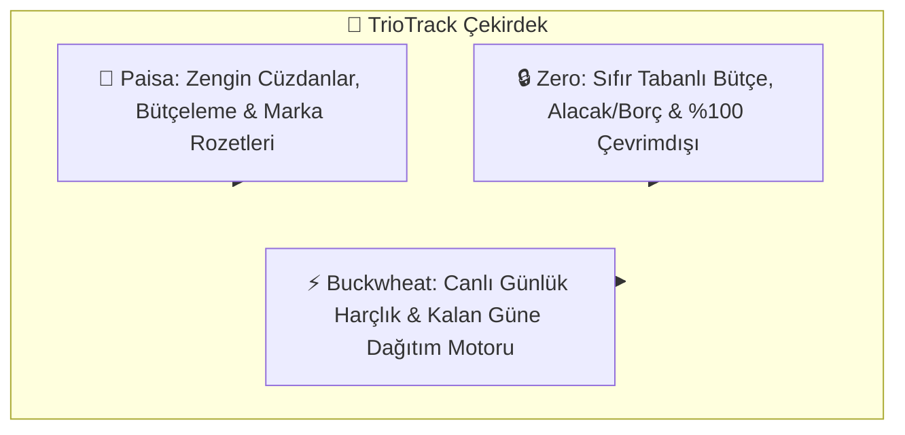
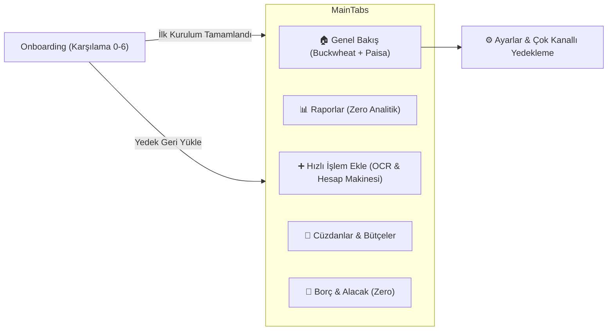
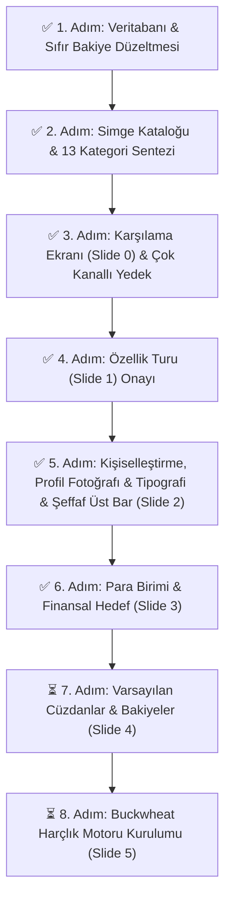

# 📘 TrioTrack — Kapsamlı Proje ve Mimari Dokümantasyonu

> **Sürüm:** 1.6.7 (Build 2026.09.11 - versionCode: 8)  
> **Son Güncelleme:** 11 Eylül 2026  
> **Durum:** Kararlı Sürüm (Biyometrik Uygulama Kilidi, Standart Headerlar & APK Derlendi)

---

## 📑 İçindekiler
1. [Proje Vizyonu ve Hibrit Felsefe](#1-proje-vizyonu-ve-hibrit-felsefe)
2. [Ekran Akışı & Adım Adım Mimari](#2-ekran-akisi--adim-adim-mimari)
3. [Karşılama Ekranı & Çok Kanallı Yedekleme Sistemi](#3-karsilama-ekrani--cok-kanalli-yedekleme-sistemi)
4. [Veri Modeli ve Depolama Mimarisi](#4-veri-modeli-ve-depolama-mimarisi)
5. [OCR, CDN Marka Logoları ve Simge Kataloğu](#5-ocr-cdn-marka-logolari-ve-simge-katalogu)
6. [Animasyon ve Arayüz Altyapısı](#6-animasyon-ve-arayuz-altyapisi)
7. [Adım Adım Yol Haritası ve Değişiklik Günlüğü](#7-adim-adim-yol-haritasi-ve-degisiklik-gunlugu)

---

## 1. Proje Vizyonu ve Hibrit Felsefe

TrioTrack, modern açık kaynak kişisel finans dünyasının en güçlü ve sevilen üç uygulamasının en iyi taraflarını tek bir yerel, gizlilik odaklı mimaride harmanlar:

### 3 Temel Direk (The 3 Pillars)
* **Paisa:**
  * Modern Material You tasarım estetiği ve dinamik renk temaları.
  * Çoklu cüzdanlar (Nakit, Banka, Kredi Kartı, Birikim).
  * Kategori bazlı harcama limitleri ve bütçe ilerleme çubukları.
  * Dijital abonelik ve platform marka rozetleri (Netflix, Spotify, YouTube vb.).
* **Zero:**
  * Sıfır tabanlı bütçeleme (Zero-based budgeting) felsefesi.
  * %100 yerel ve çevrimdışı gizlilik (Veriler yalnızca cihazda saklanır, dışa sızmaz).
  * Gelişmiş vadeli borç/alacak ve kısmi ödeme takip sistemi.
  * Akıllı çift dilli (Türkçe & İngilizce) arama normalizasyonu.
* **Buckwheat:**
  * Dinamik günlük harçlık motoru.
  * Maaş veya bütçe döngü gününe kadar her gün ne kadar harcama yapılabileceğini anlık hesaplama.
  * Harcama yapılmadığında artan bütçeyi kalan günlere akıllıca paylaştırma modu (`split_to_rest_days`).

---

## 2. Ekran Akışı & Adım Adım Mimari

Uygulamanın ekran geçiş mimarisi React Navigation Native Stack ve Bottom Tabs ile yönetilir:

---

## 3. Karşılama Ekranı, Bottom Sheet Mimarisi & Çok Kanallı Yedekleme

### 3.1. Karşılama Ekranı (Slide 0) Tasarımı
* **Resmi TrioTrack Logosu:**
  * Paisa (Viyolet/İndigo), Zero (Zümrüt Yeşili) ve Buckwheat (Kehribar Altın) kimliklerini temsil eden 3 boyutlu sonsuzluk (mobius) app ikonu üretildi ve `assets/triotrack_logo.png` olarak başlığın üstüne eklendi.
* **Hibrit Sentez Manifestosu:**
  * *"Paisa'nın zengin cüzdan estetiği, Zero'nun sıfır tabanlı gizlilik disiplini ve Buckwheat'in akıllı günlük harçlık zekası tek bir kusursuz deneyimde buluştu."*
* **3 Temel Direk Kartları:** Paisa, Zero ve Buckwheat kartları yumuşak renk tonları ve net açıklamalarla konumlandırıldı.
* **"Zaten bir yedeğim var (Geri Yükle)" Butonu:** Ekranın alt kısmında kullanıcıyı karşılar ve tek dokunuşla Bottom Sheet açar.

### 3.2. Ekranla Bütünleşik Modern Bottom Sheet (Alt Çekmece) Mimarisi
Eski masaüstü tarzı, ekranın tam ortasında beliren ve mobil hissi vermeyen kutu şeklindeki pencereler yerine **Modern Mobil Bottom Sheet Standartları** getirildi:
* **Ekran Bütünlüğü:** Ekranın tabanına oturan (`justifyContent: 'flex-end'`), üst köşeleri yumuşakça yuvarlatılmış (`borderTopLeftRadius: 28, borderTopRightRadius: 28`) tasarım.
* **Çekme Tutamacı (Sheet Handle):** Pencerenin tepesinde minimalist tutamaç çubuğu (pill bar).
* **Güvenli Alan (Safe Area):** Cihazın alt bar/çentik yüksekliğine (`insets.bottom`) dinamik uyum.
* **Doğal Kapanış:** Boş alana dokunulduğunda (`TouchableWithoutFeedback`) veya kapat butonuna basıldığında ekranın altına kayarak kapanma.
* **Uygulanan Ekranlar:** Hem `OnboardingScreen` (Yedek Geri Yükleme) hem de `SettingsScreen` (Hedef Belirleme, Yedek Alma, Yedek Yükleme).

### 3.3. Çok Kanallı Yedekleme & Geri Yükleme Motoru (`backupService.ts`)
Yedekleme sistemi tek bir metin kutusundan çıkarılmış, hem karşılama ekranında hem de ayarlar ekranında **4 farklı kanala** kavuşturulmuştur:

| Kanal | Teknoloji | Açıklama |
|---|---|---|
| 📁 **Cihazdan .json Dosyası Seç** | `expo-document-picker` + `expo-file-system` | Telefonun dosya yöneticisinden `.json` yedeğini tek dokunuşla seçip okuma. Google Drive, iCloud, İndirilenler doğrudan seçilebilir. |
| 📋 **Panodan Yapıştır (Tek Dokunuş)** | `expo-clipboard` | Kopyalanan JSON metnini otomatik algılayıp doğrulama. |
| 💾 **Cihazdaki Son Yerel Snapshot** | `AsyncStorage` (`@triotrack_local_snapshot`) | Cihaz hafızasında saklanan son güvenli kopyayı tarih ve işlem sayısıyla listeleme. |
| ✏️ **Manuel JSON Metni** | Çok satırlı `TextInput` | İleri düzey kullanıcılar için doğrudan kod yapıştırma/düzenleme alanı. |

### 3.4. Google Drive & Bulut Yedekleme Analizi: Maliyet ve Seçenekler

#### Google Drive API'si Ücretli mi? (Para Ödemek Gerekir mi?)
* **Cevap: HAYIR, tamamen ÜCRETSİZDİR (0 TL).**
* **Neden Ücretsiz?**
  1. **Google Cloud Platform (GCP) Ücretsiz Kotası:** Google Drive API çağrıları için geliştiriciden ücret talep etmez. Kişisel veya topluluk odaklı bir uygulamanın günde alacağı yedekler, GCP'nin ücretsiz kota tavanının %0.001'ine bile ulaşamaz.
  2. **Kullanıcı Başına Depolama:** Yedeklenen dosyalar geliştiricinin sunucusunda değil, **kullanıcının kendi kişisel Google Drive hesabında** durur. Her Google kullanıcısının 15 GB ücretsiz Drive kotası vardır. TrioTrack yedek dosyaları ise yalnızca **50 KB - 300 KB** (1 MB'ın bile çok altında) boyutundadır.
  3. **Hazır ve Sıfır Konfigürasyonlu Zaten Çalışan Yöntem:** TrioTrack'teki `expo-document-picker` ile "Cihazdan .json Dosyası Seç" veya Paylaş butonu tıklandığında, telefonun yerel dosya yöneticisi açılır. Android ve iOS sistem dosya yöneticisinde **Google Drive ve iCloud Drive** varsayılan olarak zaten vardır! Dolayısıyla hiçbir Google Cloud API kurulumu yapmadan bile kullanıcı dosyayı Google Drive'ına kaydedebilir veya oradan seçebilir.

### 3.5. Kullanıcı Profili, Fotoğraf/Avatar ve Tipografi Kişiselleştirmesi (Slide 2)

* **Kullanıcı Fotoğrafı Yükleme Mimarisi:**
  * Kullanıcı avatar alanına dokunduğunda açılan Bottom Sheet üzerinden **Galeriden Fotoğraf Seçme** veya **Kamera ile Çekme** imkanı (`expo-image-picker`).
  * Fotoğraflar 1:1 kare formatında kırpılır, cihazda yerel olarak saklanır (`@triotrack_user_avatar`).
* **Ham Emoji Sorununun Çözümü & Mor/Tüm Temalarda Kusursuz Kontrast:**
  * Eski `'👤'` ham emojisi kaldırıldı. Mor temada veya açık/koyu modlarda soluk ve yapay duran emoji yerine;
    1. Yüklenen gerçek kullanıcı fotoğrafı,
    2. Veya seçilen şık hazır avatar rozeti,
    3. Veya ismin baş harfinden oluşan zarif monogram harf (`colors.onPrimary`),
    4. Veya yüksek kontrastlı Ionicons vektör silüeti gösterilir.
* **6 Hazır Karakter & Rozet Stili (`avatarUtils.ts`):**
  * Fotoğraf yüklemek istemeyen kullanıcılar için tek dokunuşla seçilebilen 6 özel tematik avatar:
    * 💼 **Finansör** (`#6750A4`)
    * 🛡️ **Gizlilik** (`#009688`)
    * 🔥 **Enerjik** (`#F29F05`)
    * 🚀 **Girişimci** (`#3F51B5`)
    * 🌿 **Minimalist** (`#4CAF50`)
    * ⭐ **Vizyoner** (`#E91E63`)
* **Yazı Tipi (Tipografi) ve Yazı Boyutu Ayarları:**
  * **Modern (Sans-Serif):** Günlük, temiz, çağdaş arayüz fontu.
  * **Klasik (Serif / Georgia):** Prestijli, dengeli, geleneksel finans fontu.
  * **Teknik (Monospace / Menlo):** Kodlama ve sayısal veri odaklı finansal font.
  * **Yazı Boyutu:** Kompakt (%85), Standart (%100), Geniş (%120).
* **Evrensel Senkronizasyon:**
  * Seçilen avatar ve yazı tipi Onboarding sonrasında hem **Ayarlar (`SettingsScreen`)** profil kartında hem de **Cüzdanlar & Bütçeler (`AccountsBudgetsScreen`)** selamlama başlığında anında canlı olarak görünür.

### 3.5. Para Birimi & Finansal Hedef Mimarisi (Slide 3)
Kullanıcının harcama ve bütçeleme motivasyonunu şekillendiren Slide 3, üç temel bileşenden meydana gelir:
1. **Canlı Önizlemeli Ana Para Birimi Seçicisi:**
   * **Hero Canlı Önizleme Kartı:** Seçili para biriminin bayrağını, kodunu, adını ve dinamik olarak formatlanan örnek bakiye görünümünü (`15.450,00 ₺`, `$ 1,250.00`, `25,50 gr` vb.) anlık gösterir.
   * **2 Satırlı Eşit Genişlikli Hızlı Çipler (Quick-Chips):** En sık kullanılan 6 para birimi (`TRY ₺`, `USD $`, `EUR €`, `GBP £`, `Gram Altın 🪙`, `Bitcoin ₿`) 3'erli 2 satırda eşit genişlikte (`flex: 1`) konumlandırılmış olup ekrandan taşma veya tek başına kalma hatası ortadan kaldırılmıştır.
   * **Genişletilebilir Dünya Listesi (20+):** Akordeon menü ile açılıp kapanan, anlık arama (search) kutusu içeren tam para birimi listesi.
2. **Öncelikli Finansal Hedef (5 Hibrit Vizyon - `goalUtils.ts`):**
   * ☕ **Günlük Harçlık (Buckwheat):** Günü kurtaracak net limiti anlık bilerek stressiz harcama.
   * 📈 **Tasarruf & Birikim (Varlık):** Gereksiz harcamaları kısıp acil durum fonu ve düzenli birikim oluşturma.
   * 🛡️ **Borçları Sıfırlama (Sıfır Borç):** Kredi kartı ve şahıs borçlarını kapatana kadar adım adım takip.
   * ⚖️ **Sıfır Tabanlı Bütçe (Zero):** Her kuruşa görev verme ve gelir-gideri dengeleme.
   * 🚀 **Net Varlık & Yatırım (Paisa):** Toplam net portföy değerini ve yatırımları büyütme odağı.
   * *Düzen Mimarisi:* Başlık sol tarafa, rozet etiket sağ tarafa hizalanmış; böylece uzun başlıkların rozetle iç içe geçip kırılması engellenmiştir.
3. **Aylık Gelirden Birikim Oranı (4-Segmentli Yatay Bar & Detay Kartı):**
   * `%10` (Rahat Başlangıç), `%20` (50/30/20 Altın Kuralı - Önerilen), `%30` (Hızlı Birikim), `%50` (Finansal Özgürlük / FIRE).
   * Eşit yükseklikli 4 yatay hap buton (`flex: 1`) ve seçilen hedefin felsefesini açıklayan dinamik bilgi kartı.
4. **Veri Kalıcılığı ve Özet:**
   * `DataContext.tsx` içinde `@triotrack_financial_goal` ve `@triotrack_savings_target` anahtarlarıyla saklanır.
   * Onboarding kurulum özet kartında (Slide 6) canlı olarak listelenir.
   * JSON tam yedekleme (`exportDataAsJSON` / `importDataFromJSON`) ve sıfırlama işlemlerine eksiksiz entegre edilmiştir.

---

## 4. Veri Modeli ve Depolama Mimarisi

Tüm veriler cihaz üzerinde yerel olarak saklanır.

### Temel Varlıklar (Entities)
1. **Transaction (İşlem):**
   * `id`, `title`, `amount`, `type` (`expense` | `income` | `transfer`)
   * `categoryId`, `accountId`, `toAccountId`
   * `date` (YYYY-MM-DD), `note`
   * `receiptImage`, `receiptNo` (OCR fiş belgesi)
   * `customIcon`, `customColor`, `brandLogoUrl` (CDN logoları)
2. **Account (Hesap / Cüzdan):**
   * `id`, `name`, `type` (`cash` | `bank` | `card` | `savings`), `balance`, `color`, `icon`
3. **Category (Kategori):**
   * `id`, `name`, `icon`, `color`, `type`
4. **CategoryBudget (Bütçe):**
   * `categoryId`, `limit`
5. **Debtor (Borç & Alacak):**
   * `id`, `name`, `amount`, `type` (`debt` | `credit`), `debtCategory`, `dueDate`, `payments[]`
6. **BuckwheatMetrics (Harçlık Motoru):**
   * `dailyBudget`, `todayRemaining`, `daysRemainingInCycle`, `recalcMode`

---

## 5. OCR, CDN Marka Logoları ve Simge Kataloğu

### 5.1. Akıllı Fiş & Fatura OCR Motoru
* `expo-image-picker` ile gerçek kamera çekimi veya galeriden belge seçme.
* Canlı lazer tarama animasyonu.
* **OCR Space API** + **Yerel Heuristik Regex Motoru**:
  * Fiş üzerindeki mağaza adı, toplam tutar, tarih ve fiş numarası otomatik tespit edilir.
  * İlgili kategori ve marka logosu otomatik atanır.

### 5.2. Popüler Markalar CDN Kataloğu
* Popüler markaların (Netflix, Spotify, Getir, Trendyol, Starbucks, Shell vb.) vektörel/CDN logoları.
* Akıllı Fallback: Görsel yüklenemezse veya çevrimdışıysa otomatik monogram rozet (örn. Netflix 'N') veya Ionicons devreye girer.

### 5.3. 13 Zengin Kategori & Çift Dilli Arama (Paisa & Zero)
* 13 kategori grubu: *Abonelik & Medya, Yemek & Kafe, Fatura & Ev, Ulaşım, Alışveriş, Finans, Sağlık, Eğlence, İş/Eğitim, Ev, Evcil Hayvanlar, Doğa, İletişim*.
* Zero tarzı akıllı arama algoritması (`searchPaisaIcons`): Tire, boşluk ve Türkçe/İngilizce karakter duyarsız anında arama.
* Yatay kaydırılabilir kategori filtre çipleri (Pills).
* "Daha fazla / Daha az" dinamik genişletme düğmesi.

---

## 6. Animasyon ve Arayüz Altyapısı

> [!IMPORTANT]
> **Sorunsuz ve Kararlı Animasyon İlkesi:**  
> Kullanıcının "yeter ki sorunsuz olsun, stabil olsun" ilkesi doğrultusunda; React 19 ve Expo SDK 57 ile uyumsuzluk veya APK derleme hataları (Hermes JSI crash) yaratabilecek aşırı karmaşık kütüphaneler yerine, **Donanım Hızlandırmalı (Hardware Accelerated) Yerel Sürücü (`useNativeDriver: true`)** ve **`LayoutAnimation`** altyapısı tercih edilmiştir.

### Kullanılan Kararlı Animasyonlar:
1. **Lazer Tarama Animasyonu:** OCR ekranında 60/120fps native thread üzerinde çalışan `Animated.loop` tarama efekti.
4. **Evrensel Modal & Status Bar Bütünlüğü (`statusBarTranslucent` & `TouchableOpacity`):** Tüm modallarda (`Modal`) Android durum çubuğunun beyaz kalarak karartmayı kesmesini önleyen `statusBarTranslucent={true}` ve Android dokunma algılayıcısının (hit-testing) boş görünümleri atlamasını engelleyen garantili `TouchableOpacity` arka plan kapatma alanı (`backdropDismissArea`) entegrasyonu.
5. **Tamamen Şeffaf Yüzen Üst Navigasyon Barı:** Üst 'Geri' ve 'Atla' buton alanı arka plansız ve tamamen şeffaf (`transparent`) yapıya kavuşturulmuştur (`pointerEvents="box-none"`). Sayfa kaydırıldığında içerik bu butonların arkasından kesintisizce akar. Alt buton çubuğu ise formun altında sabit, kararlı ve güvenli orijinal yerinde korunur.

---

## 7. Adım Adım Yol Haritası ve Değişiklik Günlüğü

### Değişiklik Günlüğü (Changelog):
* **v1.6.5 (11 Eylül 2026 - versionCode: 6):**
  * **Kalıcı Tema & Tipografi Belleği (`AsyncStorage`):** Cihaz uzun süre beklemede kaldığında veya Expo Go arka plandan tekrar bağlandığında seçilen tema (Paisa, Zero, Buckwheat), tema modu (Aydınlık / Koyu), yazı tipi (Modern, Klasik, Kod), punto boyutu ve para biriminin sistem varsayılanına sıfırlanması sorunu `AsyncStorage` yerel depolama katmanıyla kalıcı olarak çözüldü.
  * **Akıllı Sürüm Bildirim Rozeti (Seen/Unseen):** Ana ekrandaki üst barda yer alan "Neler Yeni? v1.6.5" butonu yalnızca yeni bir güncelleme çıktığında görünür. Kullanıcı butona dokunup sürüm notlarını incelediğinde rozet ana ekrandan otomatik olarak kaybolur. Sürüm notlarına ve geçmişe Ayarlar ekranından her an kesintisizce erişilebilir. Yeni bir güncelleme yapıldığında rozet ana ekranda kendiliğinden tekrar aktifleşir.
  * **Mükemmelleştirilmiş Değişiklik Günlüğü Kartı (`WhatsNewModal`):** Farklı yazı tipi ve boyutlarında metin satırlarının birbiri üzerine binmesi ve kayması sorunu dinamik satır yüksekliği (`lineHeight`), sabit rozetli kart mimarisi ve pürüzsüz alt çekmece yapısıyla giderildi.
  * **Tüm Sürüm Geçmişi (v1.0.0 - v1.6.5):** İlk sürümlerden itibaren yayınlanan tüm çekirdek özellikler, yapay zeka OCR, marka CDN'leri, tema yenilikleri ve hata düzeltmeleri yatay kaydırılabilir sürüm sekmeleriyle eksiksiz olarak günlüğe eklendi.
* **v1.6.4 (10 Eylül 2026):**
  * **Roadmap 6. Adım Tamamlandı (Para Birimi & Finansal Hedefler):**
    * `goalUtils.ts` modülü oluşturuldu: 5 hibrit finansal hedef (`daily_pocket`, `saving`, `debt_free`, `zero_budget`, `investing`) ve 4 birikim oranı tier'ı (%10, %20, %30, %50) tanımlandı.
    * Slide 3 arayüzü tamamen yeniden tasarlandı:
      1. Hero Canlı Bakiye Önizleme Kartı (seçilen kura göre canlı örnek tutar biçimlendirmesi).
      2. 6 Popüler Para Birimi Hızlı Çipi (`TRY`, `USD`, `EUR`, `GBP`, `Gram Altın 🪙`, `Bitcoin ₿`).
      3. Akordeon açılır-kapanır "Tüm Dünya Para Birimleri (20+)" listesi ve canlı arama kutusu.
      4. Renkli rozetli ve radyo düğmeli 5 öncelikli finansal hedef kartı.
      5. 4 adet aylık gelir birikim oranı hedef seçeneği (%10, %20, %30, %50).
    * `DataContext.tsx` içine `financialGoal` ve `savingsTargetPercent` durumları, AsyncStorage anahtarları, `completeOnboarding` parametreleri ve JSON yedekleme desteği eklendi.
    * Onboarding Slide 6 (Özet Kartı) içine seçilen finansal hedef ve tasarruf oranı canlı olarak entegre edildi.
* **v1.6.7 (11 Eylül 2026 - versionCode: 8):**
  * **Biyometrik Kimlik Doğrulama & Uygulama Kilidi Katmanı (`expo-local-authentication`):**
    * Cihazdaki parmak izi okuyucu (Fingerprint) ve yüz tanıma (Face ID) donanımları ile tam entegre kilit sistemi eklendi.
    * Donanım bulunmayan veya biyometrik veri kaydedilmemiş cihazlar için sistem PIN/şifre geri dönüş (fallback) mimarisi sağlandı.
  * **Arka Plan & Yaşam Döngüsü Koruması (Lifecycle AppState Security):**
    * Uygulama arka plana geçtiğinde (`inactive` veya `background`) veya kapatılıp yeniden açıldığında hassas finansal verilerin korunması için kilit anında devreye girer.
    * Uygulama ön plana geldiğinde (`active`), tam ekran `BiometricLockOverlay` devreye girerek biyometrik onay ekranını otomatik tetikler.
  * **Ayarlar Güvenlik & Uygulama Kilidi Yönetim Paneli:**
    * Ayarlar sekmesine özel "GÜVENLİK & UYGULAMA KİLİDİ" kartı eklendi. Cihazın biyometrik sensör tipi (Face ID, Parmak İzi, PIN) ve kayıt durumu dinamik olarak gösterilir.
    * "Kilidi Şimdi Test Et" butonu ile kullanıcının kilidi anında deneyimlemesi sağlandı.
    * Güvenlik anahtarı açılırken önce kimlik doğrulaması şart koşularak sıfır kilitlenme (anti-lockout) koruması garantilendi.
  * **Görev Yöneticisi ve Arka Planda WhatsApp Stili Siyah Ekran (`FLAG_SECURE`):**
    * Biyometrik kilit devredeyken `expo-screen-capture` ile pencere seviyesinde `WindowManager.LayoutParams.FLAG_SECURE` bayrağı devreye alınır.
    * Kullanıcı başka bir uygulamaya geçtiğinde veya Görev Yöneticisi / Son Uygulamalar (App Switcher) ekranını açtığında, WhatsApp ve bankacılık uygulamalarındaki gibi ekran tamamen siyah bir kutu olarak maskelenir; hassas finansal verilerin sistem önizlemelerinde görünmesi ve ekran görüntüsü (screenshot) alınması engellenir.
* **v1.6.6 (11 Eylül 2026 - versionCode: 7):**
  * **Tüm Sekmelerde Tek Standart Birleşik Header Mimarisi:** Ana Sayfa, Cüzdan & Bütçe, Borçlar ve Raporlar sekmelerindeki başlık alanları kusursuz bir tasarım standardında birleştirildi.
  * **44x44 Modül Rozetleri:** Ana Sayfada profil avatarı (gerçek fotoğraf/tematik rozet/monogram), Cüzdanlar sekmesinde Cüzdan (`wallet-outline`), Borçlar sekmesinde Kişiler (`people-outline`), Raporlar sekmesinde Pasta Grafik (`pie-chart-outline`) rozetleri standart boyutta ve renk tonunda konumlandırıldı.
  * **Tipografik Standart:** Tüm sekmelerin başlık boyutu `18 * m` (`titleWeight`) olarak eşitlendi.
  * **Bağlamsal Alt Öğeler:** Zaman odaklı sekmelerde (Ana Sayfa & Raporlar) başlığın hemen altına standart kompakt ay seçici hap butonu; varlık/defter odaklı sekmelerde (Cüzdan & Borçlar) başlığın yanına sayaç rozeti (`X Hesap`, `X Aktif`) ve altına açıklayıcı alt başlık yerleştirildi.
  * **Standart Sağ Aksiyon Butonları:** Tüm sekmelere `40x40` ayarlar (`⚙️`) kısayolu, Cüzdan ve Borçlar sekmelerine ise doğrudan yeni kayıt eklemeyi sağlayan (`➕`) hızlı işlem butonları entegre edildi.
  * **Resmi Uygulama Logosu & Launcher İkon Revizyonu:** `assets/triotrack_logo.png` tüm Android launcher mipmap katmanlarına (`mdpi`, `hdpi`, `xhdpi`, `xxhdpi`, `xxxhdpi`), adaptive icon foreground/background yapılarına ve Ayarlar ekranının en altındaki marka kartına resmi logo olarak entegre edildi.
* **v1.6.5 (11 Eylül 2026):**
  * **Kalıcı Tema & Tipografi Hafızası (AsyncStorage):** Cihaz beklemedeyken veya arka plandan yeniden açıldığında seçilen tema (Paisa, Zero, Buckwheat), tema modu (Aydınlık / Koyu) ve yazı tipinin (Modern, Klasik, Kod) sistem varsayılanına sıfırlanması sorunu kalıcı olarak çözüldü.
  * **Akıllı Sürüm Bildirim Rozeti (Seen / Unseen):** Ana ekrandaki "Neler Yeni?" rozeti yalnızca güncellenmiş yeni bir sürüm olduğunda görünür; bir kez incelendikten sonra ana ekrandan kalkar ve Ayarlar sekmesinde arşivlenir.
  * **Tam Sürüm Geçmişi (Changelog):** v1.0.0 ilk çekirdek sürümünden günümüze tüm mimari adımlar ve yenilikler değişiklik günlüğüne entegre edildi.
* **v1.6.4 (10 Eylül 2026):**
  * **Android Status Bar & Modal Karartma Bütünlüğü (`statusBarTranslucent={true}`):** Android işletim sisteminde varsayılan modal pencerelerinin üst durum çubuğunun (saat, pil, wifi göstergesi) arkasına geçememesi ve tepeyi çiğ beyaz bırakması sorunu, uygulamadaki tüm 22 modala `statusBarTranslucent={true}` özelliği eklenerek kökten çözüldü. Karartma artık ekranın en tepesinden en altına kadar kesintisiz ve homojen uygulanır.
  * **Kusursuz ve Kararlı Arka Plan Dokunarak Kapatma (Backdrop Dismiss):** Android üzerinde `TouchableWithoutFeedback` içine konan arka plansız boş `View` elemanlarının dokunma olaylarını (touch hit-testing) ıskalaması ve modalı kapatmaması sorunu; yerine in-flow `TouchableOpacity` (`activeOpacity={1}`) kapatma bileşenleri ve `rgba(0, 0, 0, 0.65)` derin arka plan gölgesi yerleştirilerek %100 güvenilir hale getirildi.
* **v1.6.3 (10 Eylül 2026):**
  * **Tamamen Şeffaf Yüzen Üst Navigasyon Barı:** Onboarding ekranında üst 'Geri' ve 'Atla' butonları tamamen şeffaf (`backgroundColor: 'transparent'`) ve `pointerEvents="box-none"` yapısına getirilerek içeriğin butonların arkasından akması sağlandı.
  * **Kararlı Alt Bar Korunması:** Alt buton çubuğu ('İLERİ' ve adım göstergesi) orijinal, sabit ve taşmayan yapısında muhafaza edildi.
  * **Avatar Düğme Temizliği:** Profil fotoğrafı seçim dairesinin altındaki mükerrer metin butonu kaldırılarak doğrudan daireye dokunarak seçim yapılması sağlandı.
* **v1.6.2 (10 Eylül 2026):**
  * **Kullanıcı Fotoğrafı Yükleme:** Onboarding 3. adım (Slide 2) ve Ayarlar ekranına `expo-image-picker` ile Galeri ve Kamera üzerinden profil fotoğrafı yükleme ve kırpma yeteneği eklendi.
  * **Avatar Düğme & Arayüz Sadeleştirmesi:** Profil dairesinin altındaki mükerrer metin butonu kaldırılarak doğrudan profil dairesine ve kamera rozetine dokunularak seçim yapılması sağlandı.
  * **Ham Emoji Probleminin Çözümü:** Mor temada ve diğer seçeneklerde yapay/soluk duran `'👤'` emojisi kaldırıldı; yerine seçilen gerçek fotoğraf, 6 şık tematik avatar rozeti veya yüksek kontrastlı monogram harf getirildi.
  * **Hazır Karakter Rozetleri (`avatarUtils.ts`):** Finansör, Gizlilik, Enerjik, Girişimci, Minimalist ve Vizyoner olmak üzere 6 tematik hazır avatar seçeneği eklendi.
  * **Yazı Tipi (Tipografi) & Boyutu Seçimi:** Onboarding Slide 2'ye canlı font önizlemeli Modern (Sans-serif), Klasik (Serif/Georgia) ve Teknik (Monospace/Menlo) yazı tipi ile Kompakt/Standart/Geniş punto kontrolleri entegre edildi.
  * **Uygulama Geneli Canlı Senkronizasyon:** Profil avatarı ve yazı tipi ayarları hem Onboarding özet kartına (Slide 6), hem Ayarlar (`SettingsScreen`) ekranına, hem de Cüzdanlar (`AccountsBudgetsScreen`) selamlama başlığına bağlandı.
* **v1.6.1 (10 Eylül 2026):**
  * TrioTrack resmi sonsuzluk/mobius uygulama logosu üretildi ve Karşılama Ekranı (Slide 0) başlığının üstüne yerleştirildi.
  * Karşılama ekranına 3 uygulamanın felsefi birleşimini yansıtan ilham verici manifesto metni eklendi.
  * Karşılama ve Ayarlar ekranlarındaki tüm pencereler masaüstü tarzı yapay ortalanmış kutudan, modern mobil **Bottom Sheet (Alt Çekmece)** yapısına dönüştürüldü (`sheetHandle`, safe-area alt padding, pürüzsüz dokunarak kapanış).
  * Google Drive API maliyeti (0 TL, ücretsiz) ve bulut yedekleme alternatifleri dokümante edildi.
* **v1.6.0 (10 Eylül 2026 - versionCode: 5):**
  * Yeni nesil 7 adımlı hibrit karşılama akışı (Onboarding), şeffaf yüzen navigasyon çubuğu ve çok kanallı anında yedekten geri yükleme merkezi.
  * Kişiselleştirilebilir profil fotoğrafı seçici (Kamera, Galeri ve minimalist karakter/rozet avatarları).
  * Para birimi canlı önizlemesi ve 2x3 eşit genişlikte chip ızgarası.
  * 5 öncelikli finansal hedef kartı ve 4'lü segmented birikim oranı hapları.
  * Aydınlık temada silik kalan tüm kartlar için `#E2E8F0` net kenarlıklar, 2px canlı aktif vurgu, dinamik renkli dolu ikon kutuları ve kusursuz tipografik hiyerarşi.
  * "Her Şey Hazır!" ekranında dönen yükleme simgeleri ve yapay gecikmeler kaldırılarak ana ekrana anında geçiş sağlandı.
* **v1.5.9:**
  * Canlı kamera ve galeri entegrasyonu ile akıllı fiş/fatura OCR ayrıştırıcı motoru.
  * 35+ popüler CDN marka logoları kataloğu (`brands.ts`).
  * Evrensel modal backdrop (karartılmış alana dokunarak) kapatma özelliği.
