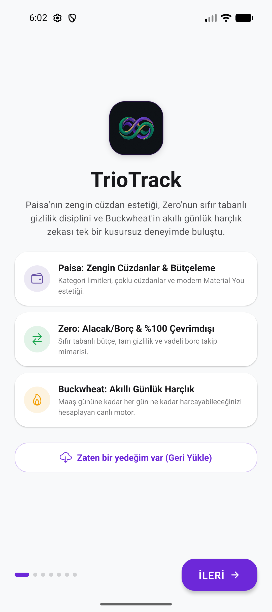
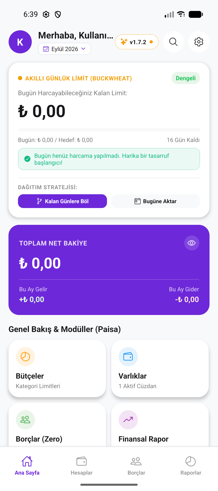
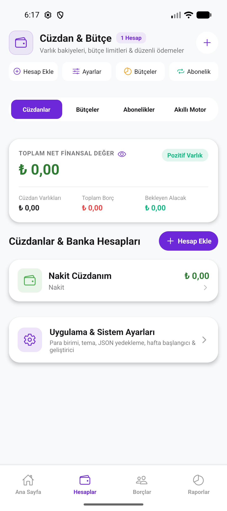
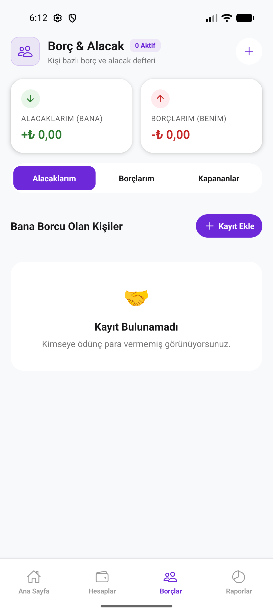
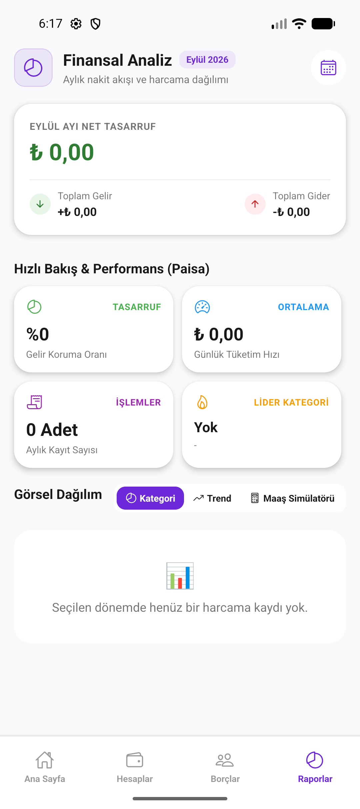
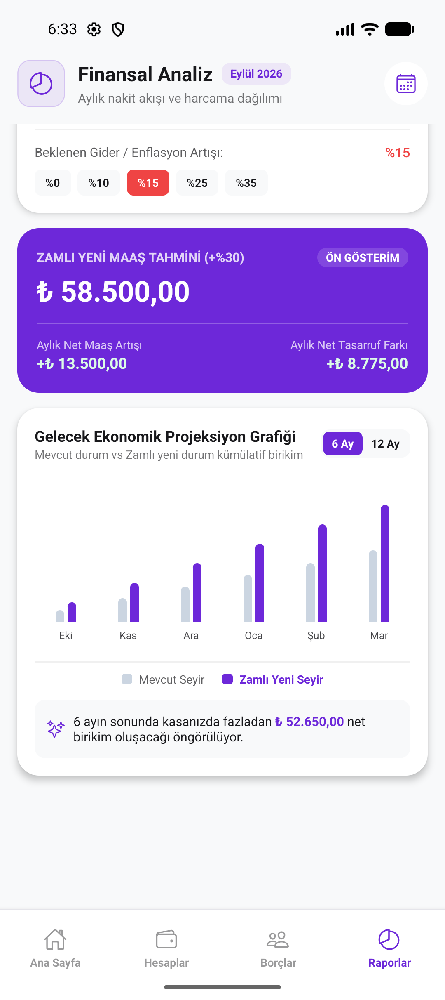

<div align="center">

# 💎 TrioTrack (v1.7.3)

### *Akıllı Kişisel Finans, Bütçe & Gelecek Ekonomik Projeksiyon Asistanı*

[](https://reactnative.dev/)
[](https://expo.dev/)
[](https://www.typescriptlang.org/)
[](https://developer.android.com/)
[](https://github.com/mehmetsensoyme/TrioTrack/releases/latest)
[](https://opensource.org/licenses/MIT)

**TrioTrack**, dünyanın en saygın üç açık kaynak kişisel finans projesinin (*Buckwheat*, *Zero* ve *Paisa*) en güçlü yönlerini modern bir arayüzde bir araya getiren; %100 çevrimdışı, biyometrik korumalı ve canlı Türk Lirası para giriş motoruna sahip yeni nesil bir bütçe takip uygulamasıdır.

</div>

---

## 🌟 Açık Kaynak İlhamı & Teşekkürler (Credits & Inspiration)

TrioTrack'in mimarisi ve felsefesi, açık kaynak topluluğunun geliştirdiği üç vizyoner projeden ilham alarak şekillendirilmiştir:

- 🌾 **[Buckwheat](https://github.com/danilkinkin/buckwheat)**: Dinamik günlük harçlık (Daily Allowance) hesaplama algoritması, maaş döngüsü günlerine göre akıllı bütçe dağıtımı ve harcama disiplini vizyonu için.
- 🎯 **[Zero](https://github.com/lossless-protocols-org/zero)**: Sıfır tabanlı bütçeleme (Zero-Based Budgeting), %100 yerel ve sunucusuz veri gizliliği, kişi bazlı borç & alacak defteri ve kısmi ödeme takip mimarisi için.
- 🎨 **[Paisa](https://github.com/h4h13/paisa-app)**: Zengin görsel analizler, Material You modüler kartları, çoklu hesap & cüzdan yönetimi ve modern mobil finansal arayüz estetiği için.

Bu değerli projeleri açık kaynak dünyasına kazandıran tüm geliştiricilere sonsuz teşekkür ederiz! 🙌

---

## 📱 Ekran Görüntüleri (Screenshots)

<div align="center">
  <table>
    <tr>
      <td align="center" width="33%">
        <br/>
        <b>1. Hibrit Karşılama (Manifesto)</b>
      </td>
      <td align="center" width="33%">
        <br/>
        <b>2. Ana Sayfa & Buckwheat Limiti</b>
      </td>
      <td align="center" width="33%">
        <br/>
        <b>3. Cüzdanlar, Varlıklar & Sıfır Tabanlı Bütçe</b>
      </td>
    </tr>
    <tr>
      <td align="center" width="33%">
        <br/>
        <b>4. Zero Tarzı Borç & Alacak</b>
      </td>
      <td align="center" width="33%">
        <br/>
        <b>5. Finansal Raporlar & Kategori Dağılımı</b>
      </td>
      <td align="center" width="33%">
        <br/>
        <b>6. Maaş Simülatörü & Gelecek Projeksiyonu</b>
      </td>
    </tr>
  </table>
</div>

---

## 🚀 Öne Çıkan Özellikler

### 1. 💼 Maaş & Gelecek Ekonomik Projeksiyon Simülatörü (Yeni v1.7.2)
- **Canlı Maaş Simülasyonu:** Mevcut net geliriniz üzerinden `%15`, `%25`, `%30`, `%40`, `%50` veya dilediğiniz özel bir oranda zam senaryosu oluşturun.
- **Enflasyon & Gider Artış Ayarı:** Beklenen harcama artış oranını katarak yeni net aylık tasarruf farkınızı görün.
- **6 & 12 Aylık Karşılaştırmalı Grafik:** Zam öncesi mevcut seyir ile zamlı yeni durum arasındaki kümülatif nakit birikim büyümesini ay ay çift sütunlu grafikte inceleyin.

### 2. 🥧 Çubuk ve Pasta (Pie / Donut) Grafikleri
- Harcama kategorileriniz için tek dokunuşla **Çubuk Dağılımı** veya ortasında toplam tutarın yazdığı **Pasta / Donut Görünümü** ve segmentli renk çubuğuna geçiş yapın.

### 3. ⌨️ Doğal Yerel Canlı Para Girişi (`CurrencyInputField`)
- Tutar kutularına rakam yazarken beklemeden anında Türkçe formatında canlı maskeleme (örn. `54885` yazıldığında anında `54.885,00 ₺`).
- Kuruşlu ve ondalıklı hesaplamalar (`1.000,50 ₺`) sıfır kayıpla güvenle işlenir.

### 4. 🌾 Buckwheat Günlük Harçlık Disiplini
- Maaş döngünüze göre kalan günlerinize düşen harcama limitini dinamik yeniden hesaplar.
- Harcamadığınız tutarları ister *Kalan Günlere Böler* ister *Bugüne Aktarır*.

### 5. 🎯 Zero Sıfır Tabanlı Bütçeleme & Borç Defteri
- Her kuruşun nereye gideceğini önceden planlayın.
- Kişi bazlı borç verme, borç alma, vade hatırlatması ve kısmi ödeme düşme özellikleri.

### 6. 🔒 Biyometrik Kilit & Gizlilik (WhatsApp Stili Karartma)
- Parmak izi ve Face ID ile verileriniz güvende.
- Görev yöneticisine geçildiğinde `FLAG_SECURE` ile ekran WhatsApp tarzında tamamen siyah görünerek gizliliğiniz korunur.

### 7. ⚡ Yüksek Performanslı Mimari
- Paralel `AsyncStorage.multiGet()` ile sıfır gecikmeli uygulama açılışı.
- UI iş parçacığını rahatlatan `250ms Debounce` kayıt mekanizması ve `useMemo` optimizasyonları.
- Parantez öncelikli ve sıfıra bölme korumalı güvenli matematik motoru (eval-free parser).

---

## 🛠️ Kurulum ve Çalıştırma

### Gereksinimler
- **Node.js**: v18+ 
- **Java**: OpenJDK 17
- **Android SDK**: Build Tools 36, Platform 36

### Adımlar

1. Depoyu klonlayın:
```bash
git clone https://github.com/<kullanici-adiniz>/TrioTrack.git
cd TrioTrack
```

2. Bağımlılıkları yükleyin:
```bash
npm install
```

3. Geliştirme sunucusunu başlatın:
```bash
npx expo start
```

4. Android Release APK derlemesi almak için:
```bash
cd android
export JAVA_HOME=/opt/homebrew/opt/openjdk@17  # macOS Homebrew için
./gradlew assembleRelease --no-daemon
```
*Derlenen APK konumu:* `android/app/build/outputs/apk/release/app-release.apk`

---

## 📄 Lisans
Bu proje [MIT Lisansı](LICENSE) altında sunulmaktadır.
